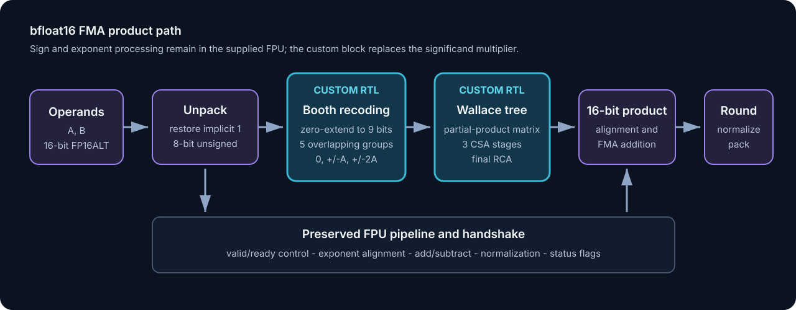
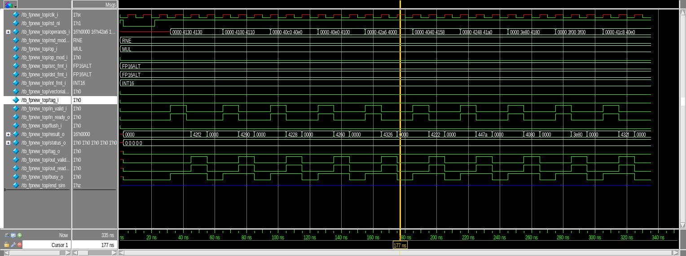
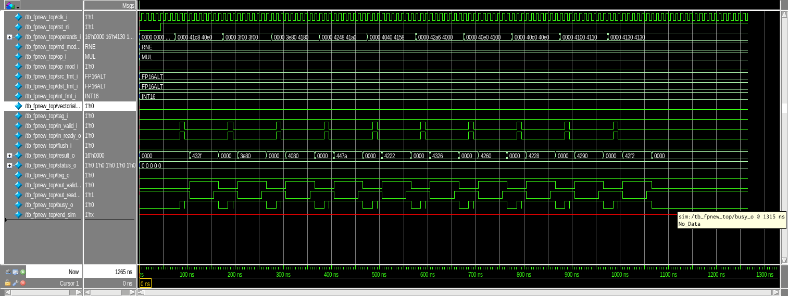

# Radix-4 Booth-Wallace Multiplier for a bfloat16 FPU

This project replaces the significand multiplier inside a supplied bfloat16 (`FP16ALT`) FPU with a custom unsigned radix-4 Modified Booth datapath. Five overlapping Booth groups generate partial products, a three-stage Wallace network compresses them, and a final ripple-carry adder produces the 16-bit significand product. Saved Questa simulations reproduce all 10 baseline reference products and all 11 products exercised after integration, including a negative-result case. Synopsys Design Compiler reports compare the original FPU across five synthesis strategies with the custom implementation.

[Technical report](output/pdf/lab2-report.pdf)



## Architecture

- Format: 16-bit bfloat16/`FP16ALT` with one sign bit, eight exponent bits, and seven stored fraction bits.
- The FPU restores the implicit leading bit, producing two unsigned 8-bit significands.
- Each significand is zero-extended to nine bits before Booth recoding.
- Five radix-4 groups use overlapping three-bit slices of the multiplier.
- Three carry-save compression stages reduce the partial-product matrix.
- A final ripple-carry adder and the retained low-order bits form the 16-bit product consumed by the existing FMA alignment, addition, normalization, and rounding logic.

## Verification

Directed SystemVerilog testbenches exercise the FPU through its valid/ready interface. Expected bfloat16 encodings were generated with the supplied FlexFloat-based C++ utility and reconciled against the saved Questa transcripts.

| Configuration | Directed products | Matching logged results | Evidence |
|---|---:|---:|---|
| Supplied FPU multiplier | 10 | 10 | [`baseline-fpu.txt`](results/simulation/baseline-fpu.txt) |
| Custom Booth-Wallace multiplier in FPU | 11 | 11 | [`r4-wallace-fpu.txt`](results/simulation/r4-wallace-fpu.txt) |





## Synthesis results

All runs target the Nangate Open Cell Library typical view with 0.07 ns clock uncertainty, 0.5 ns maximum input/output delay, and a `BUF_X4`-equivalent output load. Frequencies below are calculated from the actual `create_clock` capture edge recorded in each timing report.

| FPU implementation | Synthesis strategy | Clock constraint | Maximum clock | Critical data arrival | Cell area | Slack |
|---|---|---:|---:|---:|---:|---:|
| Supplied multiplier | `compile` | 2.50 ns | 400.00 MHz | 1.93 ns | 4,431.29 um^2 | 0.00 ns |
| Supplied multiplier | `compile` + retiming | 1.99 ns | 502.51 MHz | 1.89 ns | 3,941.06 um^2 | 0.00 ns |
| Supplied multiplier | `compile_ultra` | 2.18 ns | 458.72 MHz | 2.08 ns | 3,548.17 um^2 | 0.00 ns |
| Supplied multiplier | forced CSA + retiming | 1.95 ns | 512.82 MHz | 1.84 ns | 4,131.25 um^2 | 0.00 ns |
| Supplied multiplier | forced PPARCH + retiming | 1.85 ns | 540.54 MHz | 1.74 ns | 4,212.64 um^2 | 0.00 ns |
| Custom Booth-Wallace | `compile` + retiming | 1.87 ns | 534.76 MHz | 1.76 ns | 4,439.27 um^2 | 0.00 ns |

At the saved points, the custom multiplier is 1.1% lower in maximum clock rate and 5.4% larger in cell area than the forced-PPARCH run. It is 16.6% higher in maximum clock rate and 25.1% larger than the `compile_ultra` run.

The six-run table and direct report references are in [`results/verified_results.csv`](results/verified_results.csv).

## Flow

```text
FlexFloat bfloat16 reference values
    -> SystemVerilog directed testbench
    -> supplied CVFPU-lite RTL / custom Booth-Wallace RTL
    -> Questa RTL and saved netlist simulations
    -> Design Compiler strategy sweep and timing/area/resource reports
```

## Repository

| Path | Contents |
|---|---|
| [`cvfpu_lite/src/`](cvfpu_lite/src/) | Supplied CVFPU-lite SystemVerilog source |
| [`cvfpu_lite/tb/`](cvfpu_lite/tb/) | Baseline RTL and netlist testbenches |
| [`cvfpu_lite/sim/`](cvfpu_lite/sim/) | Baseline RTL simulation scripts |
| [`cvfpu_lite/syn/`](cvfpu_lite/syn/) | Baseline synthesis script and five-run report set |
| [`cvfpu_lite/ex3/src/`](cvfpu_lite/ex3/src/) | Final custom multiplier and modified FPU source |
| [`cvfpu_lite/ex3/tb/`](cvfpu_lite/ex3/tb/) | Custom multiplier and integrated-FPU testbenches |
| [`cvfpu_lite/ex3/sim/`](cvfpu_lite/ex3/sim/) | Final RTL simulation scripts |
| [`cvfpu_lite/ex3/syn/`](cvfpu_lite/ex3/syn/) | Custom implementation synthesis script and reports |
| [`results/`](results/) | Reconciled table and simulation transcript extracts |
| [`docs/provenance.md`](docs/provenance.md) | Supplied, third-party, student-authored, and generated-file boundaries |

## Reproduction

RTL simulation requires Questa/ModelSim. Synthesis requires Synopsys Design Compiler with DesignWare and the Nangate Open Cell Library in an environment matching the paths in the scripts.
